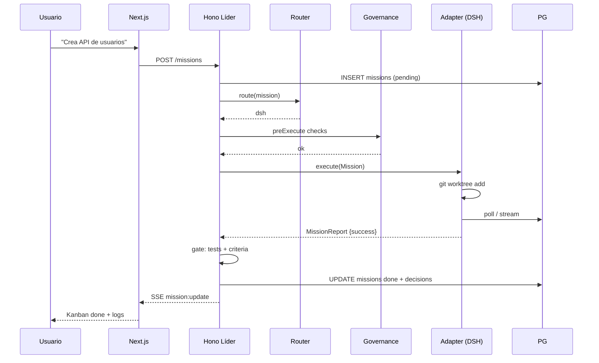

# 1. Arquitectura del Sistema — Cerebro de Agentes

> Estado: **Definición completa**. Reemplaza placeholder `123456...23` del plan original.

## 1.1 Visión

**Cerebro de Agentes** es un orquestador multi-agente con patrón **Líder → Pro Agents**. El Líder (Hono API) recibe objetivos del usuario vía Frontend (Next.js), los descompone en misiones tipadas (Zod), las rutea al adaptador óptimo y supervisa su ejecución bajo gobernanza estricta (aislamiento, gate de calidad, memoria).

```
Usuario ──HTTP/SSE──▶ Next.js 15 (apps/web)
                        │ Server Actions / fetch
                        ▼
                    Hono API (apps/orchestrator) — Líder
                        │  TaskRouter + Supervisor + Governance
              ┌─────────┼─────────┐
              ▼         ▼         ▼
          Qwen API  DSH Gateway  Opencode CLI
          (plan/    (build/      (refactor/
           review)    execute)     tests)
              │         │         │
              └─────────┼─────────┘
                        ▼
                PostgreSQL 16 + pgvector
                (misiones, reportes, decisions, embeddings)
```

## 1.2 Principios

1. **Contratos primero**: todo intercambio Líder↔Agente validado por Zod (`packages/shared/protocols.ts`). Sin schema válido no hay ejecución.
2. **Aislamiento por defecto**: cada misión en `git worktree` + rama `mission/<id>`. Nunca `main`.
3. **Observabilidad total**: SSE para logs en tiempo real, `traceId` propagado, tabla `decisions` para memoria.
4. **Fallo explícito**: timeout, reintento acotado, escalado a Qwen con traceback.

## 1.3 Componentes

| Componente | Código | Responsabilidad |
|---|---|---|
| **Frontend** | `apps/web` | Chat → Orquestador, Kanban de misiones (lectura PG), SSE streaming |
| **Orquestador (Líder)** | `apps/orchestrator/src/index.ts` | Hono server, Zod validation, `TaskRouter`, `Supervisor`, `GovernanceGuard` |
| **Frontend** | `apps/web` | Chat Misiones (`/`) + **Qwen Chat** (`/qwen-chat` streaming, selector modelo, login en caliente) + Kanban (`/dashboard`), SSE |
| **Orquestador (Líder)** | `apps/orchestrator/src/index.ts` | Hono server, Zod validation, `TaskRouter`, `Supervisor`, `GovernanceGuard`, `qwenChatRouter` |
| **Qwen Chat** | `apps/orchestrator/src/bridges/qwen.chat.ts` | **QwenMax-3.8** vía `chat.qwen.ai` Playwright `PersistentContext` `%LOCALAPPDATA%\CerebroQwen\user-data` (sin API), streaming incremental, login |
| **Qwen Adapter** | `apps/orchestrator/src/bridges/qwen.ts` | Wrapper `Adapter` para `plan/review/unblock` + `consultArchitectChat` para chat libre |
| **DSH Adapter** | `apps/orchestrator/src/adapters/deepseek.ts` | HTTP/MCP hacia plugin `dsh-mission-gateway` (a crear en DSH). Delegación a subagentes internos |
| **Opencode Adapter** | `apps/orchestrator/src/adapters/opencode.ts` | `spawn` → `opencode run --format json --dir <worktree>` |
| **DB** | `apps/orchestrator/src/db` | Drizzle ORM, `missions`/`reports`/`decisions`/`qwenConversations`/`qwenMessages`/`qwenMemory` (+ futuro `obsidianDocuments`), `pgvector` + pglite fallback |
| **Shared** | `packages/shared` | Zod schemas, tipos, `MissionType`, `Complexity` |
| **Scripts** | `iniciar.bat`/`iniciar.ps1` | Levantan todo el entorno (checks, pnpm, playwright, DB, orquestador 3001 + web 3000) |

## 1.4 Flujo de una misión (Turn)

```text
1. Usuario envía objetivo en Chat (Next.js) → POST /api/missions {title, prompt, type?, acceptanceCriteria}
2. Hono valida con MissionSchema, crea registro `missions` status=pending, genera worktree
3. TaskRouter.route(mission) → AdapterId
     high + plan → qwen
     refactor|tests → opencode
     build|execute → dsh
4. GovernanceGuard.preExecute(mission) → bloquea regex destructivos, verifica toolsAllowed
5. Adapter.execute(mission) → escribe prompt estructurado, invoca agente, poll/stream
6. Adapter retorna MissionReport → Supervisor valida
7. Gate de calidad: ¿tests pasan? ¿acceptanceCriteria cumplidos? Si no → retry (max 3) o escalado a Qwen
8. Si éxito → merge worktree → main (o PR), status=done, guarda decisions. Si fallo tras 3 → status=failed + escalado
9. SSE emite `mission:update` → Frontend Kanban + log streaming
```

## 1.5 Diagrama de secuencia (éxito)



## 1.6 Decisiones de arquitectura (ADRs)

| ADR | Decisión | Alternativa descartada | Razón |
|---|---|---|---|
| ADR-001 | Hono como Líder HTTP (no plugin Cordis) | Plugin `@deepseek-ai/dsh-brain` | Desacopla Cerebro de DSH, permite deploy independiente, familiar para equipo |
| ADR-002 | Zod como única validación | Typert (DSH) | Compartido Frontend/Backend/Agentes, sin codegen |
| ADR-003 | QwenMax-3.8 vía Chat Playwright (PersistentContext), sin API | Qwen API `qwen-token-plan` | Requisito explícito: Qwen Chat QwenMax-3.8, sesión GitHub, sin APIs. Playwright + selectores robustos + login en caliente |
| ADR-003b | Qwen Chat escalable con PG + streaming + auto-misión | Chat efímero sin persistencia | Escalabilidad y Obsidian futuro: conversaciones y mensajes en PG, streaming incremental, si intent==project auto-genera `Mission` y ejecuta vía `Supervisor` |
| ADR-004 | `git worktree` + `sandbox-policy` para aislamiento | Solo ramas | Aislamiento FS real, permite ejecución paralela |
| ADR-005 | PostgreSQL + pgvector | SQLite + sqlite-vec | Necesario para RAG futuro y concurrencia; pglite para tests locales |

## 1.7 Límites y no-objetivos v1

* No multi-tenant (single user).
* No auto-escalado horizontal (single Hono instance).
* No marketplace de agentes externos.
* pgvector usado solo para `decisions` RAG v1; no embeddings masivos hasta FASE 6.

## 1.8 Referencias

* `docs/stack.md` — stack detallado y mitigaciones Windows
* `docs/protocols.md` — contratos Zod
* `docs/adapters.md` — cada adaptador a fondo
* `docs/governance.md` — reglas hard constraints
* `deepseek-harness/docs/architecture.md` — inspiración turn flow (`turn/start → llm/stream → tools/execute`)
